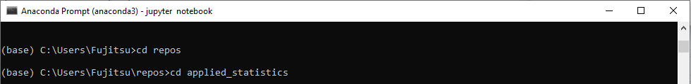
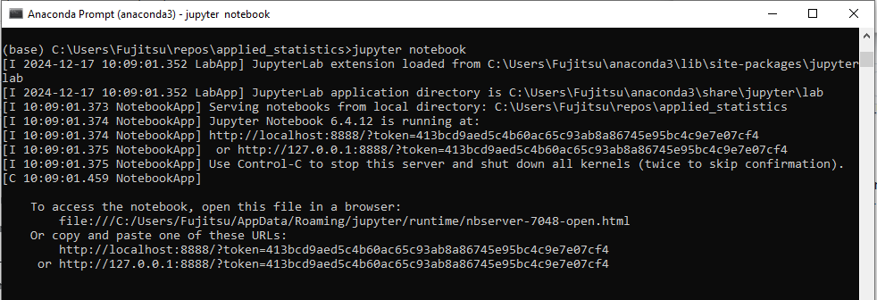
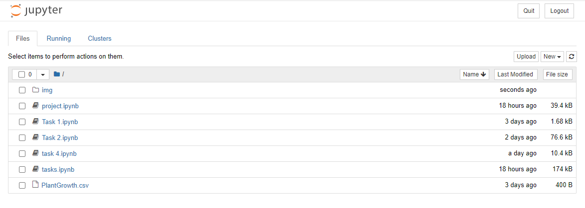

# Module : Applied Statistics

**by Michael Allen (g00425633@atu.ie)**

This repository contains my assessment for the Applied Statistics module.

## PURPOSE
The purpose of the assessment is for you to demonstrate ability in the following.

- Describe the stochastic nature of real-world measurements.

- Source documentation to programmatically perform a statistical test.

- Select an appropriate statistical test to investigate a claim.

- Perform a statistical test on a data set.

The assessment consists of three overlapping parts: a GitHub repository containing all your work (20%), a series of tasks (40%), and a small project (40%).

## CONTENTS
### Contents of Tasks
Complete all tasks in a notebook called 'tasks.ipynb' in your repository.

For each task, you should write your code in code cells while using MarkDown cells to give explanations and insights into your code. Break up your code into smaller, manageable cells whenever possible. Each code cell should focus on a single step in your overall solution.

Include comments in all code cells to tell the reader what each statement does. Write clean, readable, and efficient code, using meaningful variable names and consistent formatting. You should follow Python coding standards and guidelines such as PEP8.

Make regular commits to your repository while completing the tasks. Your commit history should demonstrate how each solution to each task evolved. There should be several commits for each task demonstrating incremental improvements, clarifications, and revisions.

### Contents of Project 
Complete the project in a single notebook called `project.ipynb` in your repository. The same style should be used as detailed above: explanations in MarkDown and code comments, clean code, and regular commits. Use plots as appropriate.

In this project, you will analyze the PlantGrowth R dataset. You will find a short description of it on Vicent Arel-Bundock's Rdatasets page. The dataset contains two main variables, a treatment group and the weight of plants within those groups.

Your task is to perform t-tests and ANOVA on this dataset while describing the dataset and explaining your work.

## INSTRUCTIONS
### How to clone and run notebook
1. Download and Install Anaconda. Here's the link:
[Download and Install Anaconda](https://www.anaconda.com/download/)

2. Download and Install Visual Studio Code. Here's the link:
[Download and Install Visual Studio Code](https://code.visualstudio.com/)

3. Clone Repository as follows:
  - On GitHub.com, navigate to the main page of the repository.
  
  - Above the list of files, click Code.
  
  
  - Copy the URL for the repository.
  
  
  - Open Git Bash.
  
  - Change the current working directory to the location where you want the cloned directory.
  
  - Type `git clone`, and then paste the URL you copied earlier.
  
  - Press Enter to create your local clone.
    The steps for cloning a repository are detailed in the link below:
    [Cloning a repository](https://docs.github.com/en/repositories/creating-and-managing-repositories/cloning-a-repository)

5. Open Repository in Visual Studio Code
[Open a repository](https://code.visualstudio.com/docs/sourcecontrol/intro-to-git#_open-a-git-repository)

Alternatively you can open the repository in a Jupyter notebook.

Refer to these snapshots for a step-by-step guide to open the repository in a Jupyter notebook:

**Step 1**: Change directory. Open applied_statistics directory.

**Step 2**: Run command `jupyter notebook`

**Step 3**: The notebook opens in a web browser. It contains `tasks.ipynb` and `project.ipynb`

## ISSUES
### Troubleshooting cloning errors

[Troubleshooting cloning errors](https://docs.github.com/en/repositories/creating-and-managing-repositories/troubleshooting-cloning-errors)

If you're having trouble cloning a repository, check these common errors.
1. HTTPS cloning errors
 - Check your Git version
 - Ensure the remote is correct
 - Provide an access token
 - Check your permissions
 - Use SSH instead
 
 2. Error: Repository not found
  - Check your spelling
  - Checking your permissions
  - Check your SSH access
  - Check that the repository really exists
  
 3. Error: Remote HEAD refers to nonexistent ref, unable to checkout

## RESEARCH
### RESEARCH for TASKS
- https://docs.python.org/3/library/random.html#random.sample
- https://docs.python.org/3/tutorial/datastructures.html#sets
- https://docs.scipy.org/doc/scipy/reference/generated/scipy.stats.shapiro.html
- https://en.wikipedia.org/wiki/Normal_distribution
- https://docs.scipy.org/doc/scipy/reference/generated/scipy.stats.shapiro.html#shapiro
- https://docs.scipy.org/doc/scipy/reference/generated/scipy.stats.ttest_ind.html#ttest-ind
- https://machinelearningmastery.com/how-to-code-the-students-t-test-from-scratch-in-python/
- https://en.wikipedia.org/wiki/Student%27s_t-test
- https://en.wikipedia.org/wiki/T-test#Dependent_t-test_for_paired_samples
- https://docs.scipy.org/doc/scipy/reference/generated/scipy.stats.ttest_rel.html#ttest-rel
- https://www.scribbr.com/statistics/t-test/
- https://machinelearningmastery.com/how-to-code-the-students-t-test-from-scratch-in-python/
- https://statistics.laerd.com/statistical-guides/one-way-anova-statistical-guide-4.php
- https://docs.scipy.org/doc/scipy/reference/generated/scipy.stats.tukey_hsd.html#tukey-hsd
- https://researchdatapod.com/type-ii-error-calculator/

### RESEARCH for PROJECT
- https://docs.python.org/3/library/math.html
- https://docs.python.org/3/library/itertools.html
- https://docs.python.org/3/library/random.html
- https://numpy.org/doc/stable/reference/index.html#reference
- https://matplotlib.org/stable/contents.html
- https://vincentarelbundock.github.io/Rdatasets/doc/datasets/PlantGrowth.html
- https://statistics.laerd.com/statistical-guides/types-of-variable.php
- https://en.wikipedia.org/wiki/Student%27s_t-test
- https://statistics.laerd.com/spss-tutorials/independent-t-test-using-spss-statistics.php
- https://statistics.laerd.com/spss-tutorials/independent-t-test-using-spss-statistics.php
- https://statistics.laerd.com/spss-tutorials/independent-t-test-using-spss-statistics.php
- https://statistics.laerd.com/stata-tutorials/paired-t-test-using-stata.php
- https://statistics.laerd.com/statistical-guides/one-way-anova-statistical-guide-4.php
- https://docs.scipy.org/doc/scipy/reference/generated/scipy.stats.tukey_hsd.html#tukey-hsd
- https://statistics.laerd.com/statistical-guides/one-way-anova-statistical-guide-2.php

